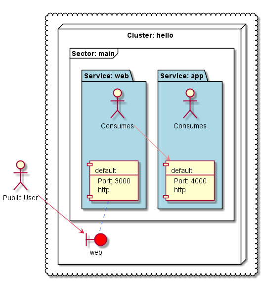

# Berlioz Sample
## Polyglot Microservices

This is a sample application with 3 microservices:
* **WEB**: A web frontend written in Node.js,
* **APP**: A backend service written in Python,
* **BILL**: A backend service written in Java.

**WEB** is talking to **APP**, **APP** is talking to **BILL**.

We depoy this sample app using Berlioz to local computer as well as to the cloud. 

The easiest way to see it running is to follow live scenario in Katacoda: [https://www.katacoda.com/berlioz/scenarios/first-local-app](https://www.katacoda.com/berlioz/scenarios/first-local-app)